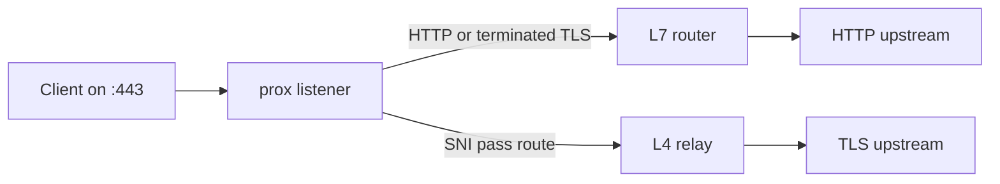

# prox


<p><strong>High-throughput HTTP routing and raw TCP pass-through on the same listener.</strong></p>
<p>A single-binary reverse proxy with automatic certificates, JSON5 configuration, atomic reloads, and external plugins.</p>
<p>
  <a href="https://github.com/dortanes/prox/actions/workflows/ci.yml"></a>
  <a href="https://pkg.go.dev/github.com/dortanes/prox"></a>
  <a href="https://github.com/dortanes/prox/releases"></a>
  <a href="LICENSE"></a>
</p>
<p>
  <a href="#installation">Install</a> ·
  <a href="#quick-start">Quick start</a> ·
  <a href="https://dortanes.github.io/prox">Documentation</a> ·
  <a href="https://github.com/dortanes/prox/releases">Releases</a> ·
  <a href="CONTRIBUTING.md">Contributing</a>
</p>

<br clear="left">

## Why prox

- **One listener for L4 and L7.** Route and balance HTTP by domain, path, method, or headers while passing selected TLS connections directly to TCP upstreams based on SNI.
- **Complete ACME automation.** Issue and renew certificates through Let's Encrypt, ZeroSSL, or custom ACME CAs. TLS-ALPN-01, HTTP-01, and Cloudflare DNS-01 are supported, including API-based zone discovery, automatic apex and wildcard certificates, OCSP stapling, and shared S3-compatible storage.
- **Built for sustained traffic.** Designed for high-volume data transfer and already used in production for bandwidth-intensive workloads including audio and video streaming, large file delivery, long-lived connections, and high-concurrency TCP services such as VPN gateways.
- **Configuration built for operations.** Validate JSON5 before deployment, split large configurations across files, and apply changes without dropping active connections.
- **Extensions stay out of process.** Add authorization, header and response changes, connection gates, speed limits, or dynamic target discovery through external plugins and the Go SDK.

Request and response plugin hooks use Unix domain sockets and require Linux or macOS. Push-based plugin APIs are also available on Windows.



## Installation

### Release archive

Download the latest archive for your operating system and architecture from [GitHub Releases](https://github.com/dortanes/prox/releases/latest). Extract `prox` (`prox.exe` on Windows), place it on your `PATH`, and verify the installation:

```bash
prox version
```

### Container

The container image supports Linux on AMD64 and ARM64:

```bash
docker run --rm ghcr.io/dortanes/prox:latest prox version
```

### Go

Install with Go 1.25 or later:

```bash
go install github.com/dortanes/prox/cmd/prox@latest
prox version
```

## Quick start

Create `config.json5`. This first route has no external dependencies and returns a static response:

```json5
{
  services: {
    hello: {
      listen: ":8080",
      routes: [
        {
          action: {
            type: "static",
            status: 200,
            headers: { "Content-Type": "text/plain" },
            body_ref: { text: "prox works\n" },
          },
        },
      ],
    },
  },
}
```

Validate the configuration, then start prox:

```bash
prox validate -config config.json5
# ✅ configuration is valid: config.json5 (1 file(s))

prox serve -config config.json5
```

Send a request through prox from a third terminal:

```bash
curl http://127.0.0.1:8080
# prox works
```

To proxy an HTTP backend, replace the inline action with `{ type: "proxy", upstream: "127.0.0.1:3000" }`.

Configuration files are watched by default. Valid changes are applied atomically; rejected reloads are logged and the last valid configuration remains active.

## Automatic HTTPS

Add an `acme` block to a service to enable TLS. prox discovers domains from its routes, obtains certificates from Let's Encrypt by default, renews them before expiration, and enables OCSP stapling:

```json5
acme: {
  email: "certs@example.com",
}
```

For multi-domain and wildcard deployments, Cloudflare DNS discovery can enumerate every active zone in the account and manage certificates for both the apex domain and its wildcard:

```json5
acme: {
  email: "certs@example.com",
  challenge: "dns",
  dns: {
    provider: "cloudflare",
    discover: true,
  },
}
```

Pass the API token through `CF_DNS_API_TOKEN`. Set `ca: "zerossl"` to use ZeroSSL, configure `cas` for ordered CA fallback, or provide any ACME directory URL. See [TLS and certificates](https://dortanes.github.io/prox/tls/) for challenge requirements, staging, persistent storage, and multi-server deployments.

## HTTP and TCP on one listener

The same TLS listener can terminate HTTP traffic for one domain and pass another domain to a raw TCP upstream:

```json5
{
  services: {
    edge: {
      listen: ":443",
      tls: true,
      tls_cert: "/etc/prox/certs/",
      routes: [
        {
          match: { domain: "mqtt.example.com" },
          action: { type: "pass", upstream: "10.0.0.10:8883" },
        },
        {
          match: { domain: "app.example.com" },
          action: { type: "proxy", upstream: "10.0.0.20:8080" },
        },
      ],
    },
  },
}
```

Connections for `mqtt.example.com` keep their original TLS session and are relayed at L4. Connections for `app.example.com` terminate TLS in prox and continue through the HTTP router. Route order determines the first matching action; see [deployment and L4 dispatching](https://dortanes.github.io/prox/deployment/#l4-dispatching) for the full behavior.

## Documentation

| Task | Guide |
| --- | --- |
| Install prox and run the first route | [Getting started](https://dortanes.github.io/prox/getting-started) |
| Match traffic and configure actions | [Routing](https://dortanes.github.io/prox/configuration/routing/) and [actions](https://dortanes.github.io/prox/configuration/actions/) |
| Terminate TLS or configure pass-through | [TLS and certificates](https://dortanes.github.io/prox/tls/) |
| Build authorization or discovery plugins | [Plugins](https://dortanes.github.io/prox/plugins/) and the [Go SDK](https://dortanes.github.io/prox/plugins/sdk/) |
| Deploy the binary or container | [Deployment](https://dortanes.github.io/prox/deployment/) |
| Inspect health, routes, and certificates | [Admin API](https://dortanes.github.io/prox/admin-api/) |

## Performance

The repository includes a [macOS benchmark harness](bench/README.md) for comparing the current checkout with Nginx, HAProxy, Caddy, and Traefik under the same local HTTP/1.1 workload. It reports an upstream baseline, environment metadata, and the median of five runs. Treat its output as a local measurement rather than a portable ranking.

## Development

```bash
git clone https://github.com/dortanes/prox.git
cd prox
make check
make validate
```

See [CONTRIBUTING.md](CONTRIBUTING.md) for setup, contribution, and release requirements.

Use the [issue tracker](https://github.com/dortanes/prox/issues/new/choose) for reproducible bugs and focused feature requests.

## Security

Report vulnerabilities privately through the process in [SECURITY.md](SECURITY.md). Do not disclose security issues in public GitHub issues.

## License

prox is available under the [MIT License](LICENSE).

If prox is useful in your stack, [star the repository](https://github.com/dortanes/prox) so other operators can discover it.
